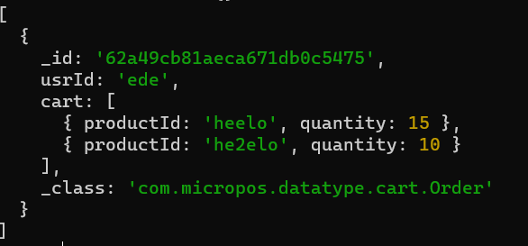

# Spring Integration实验报告

| 学号      | 姓名   |
| --------- | ------ |
| 191220162 | 张乐简 |

[TOC]

## 概述

​		使用Spring Integration，将订单服务pos-delivery作为一个独立的服务供外界访问。

## 实验内容

### 导入依赖

​		主要用到spring-boot-starter-integration和spring-integration-http两个依赖。

```xml
        <dependency>
            <groupId>org.springframework.boot</groupId>
            <artifactId>spring-boot-starter-integration</artifactId>
        </dependency>

        <dependency>
            <groupId>org.springframework.integration</groupId>
            <artifactId>spring-integration-http</artifactId>
        </dependency>
```

### 发送消息

​		在客户要求下订单时，pos-cart将通过restTemplate向pos-delivery发送一个Http请求。

```java
        String uri = "http://localhost:8084/show";
        restTemplate.postForEntity(uri,order,null);
```

### 处理消息

​		在pos-delivery中定义一个工作流。这一步通过Spring Integration DSL实现。

```java
    @Bean
    IntegrationFlow handleDeliveryWorkFlow(){
        return IntegrationFlows.from(Http.inboundGateway("/order")
                        .requestPayloadType(Order.class)
                )
                .handle((o)->{
                    Order myOrder=(Order)o.getPayload();
                    System.out.println(myOrder.usrId);
                    deliveryService().handleDelivery(myOrder);
                })
                .get();
    }
```

​		IntegrationFlow从Http的inboundGateway处接受消息，并将消息中的Order提取出来交给service处理，具体来说就是将订单存入数据库。

​		

​		打开数据库，可以发现订单已经被存储。

## IntegrationFlow的优点

​		将Delivery完全作为一个独立的服务后，该部分功能的代码和其他部分完全解耦，只留下一个Http接口，但光是这个似乎通过微服务本身也能实现。不过，使用IntegrationFlow这种声明式的编程更加关注业务的逻辑而非具体实现流程，使得整个业务逻辑的编写更为抽象，让程序员可以集中于业务逻辑本身。同时，它可以规定使用一些编写时尚未可能尚未确定的代码，也可以让业务的各个部分之间耦合度更低（不需要相互调用实际的实现），便于进一步的扩展和修改。

