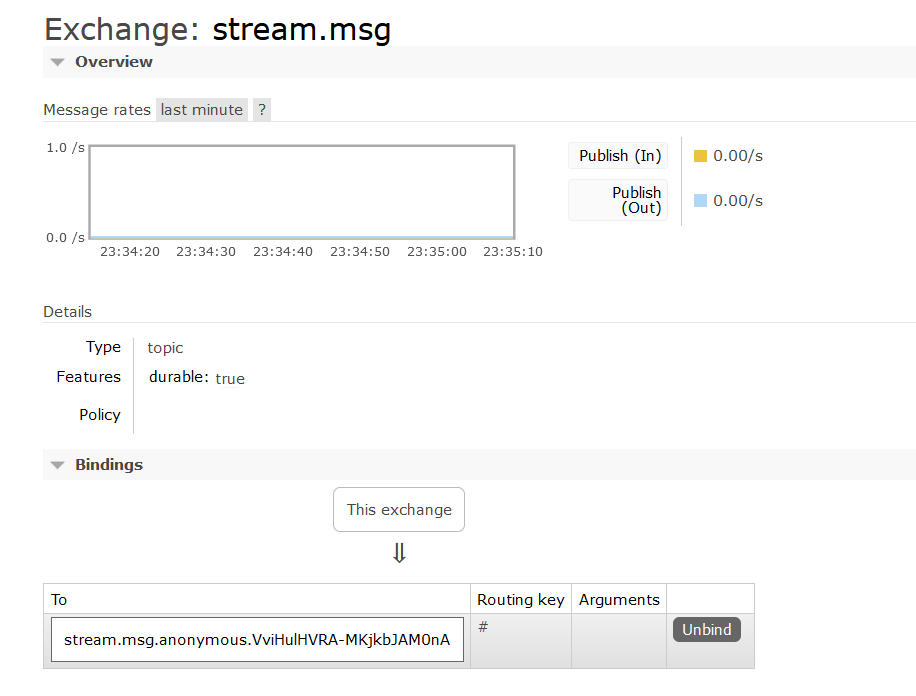
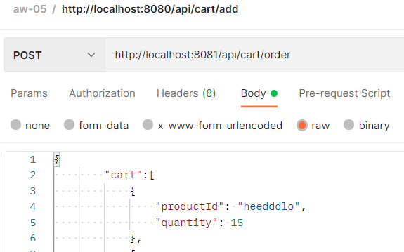
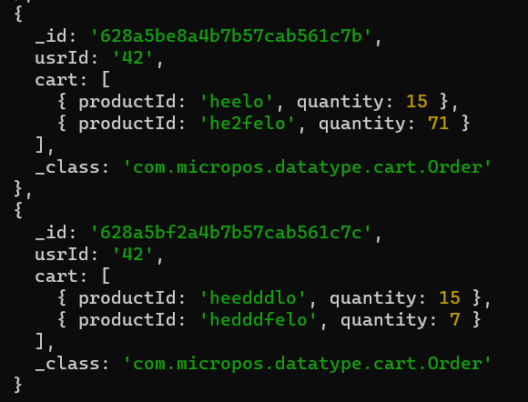
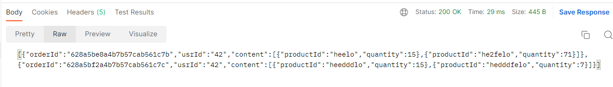
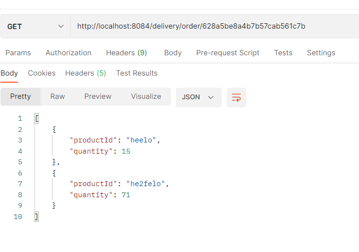

# Spring Cloud Stream实验报告

| 学号      | 姓名   |
| --------- | ------ |
| 191220162 | 张乐简 |

[TOC]

## 概述

​		使用Spring Cloud Stream集成了RabbitMQ，完成了Delivery微服务，为用户提供了查询订单的api。

## 实验内容

### 导入依赖

​		使用RabbitMQ，spring-cloud-stream-binder-rabbit则采用最新的3.2.3版。

```xml
        <!-- https://mvnrepository.com/artifact/org.springframework.cloud/spring-cloud-stream-binder-rabbit -->
        <dependency>
            <groupId>org.springframework.cloud</groupId>
            <artifactId>spring-cloud-stream-binder-rabbit</artifactId>
            <version>3.2.3</version>
        </dependency>
```

​	为负责生产订单消息的Cart微服务和消费订单消息的Delivery微服务添加上述依赖。

### 制作工具类

​		这部分将简要介绍一下项目中遇见的几个工具类。代码参考https://www.bilibili.com/video/BV1BV411n7R9。

#### Source与Sink

​		这两个类负责定义MessageChannel，或者说Binder。例如，Source类定义了Output Binder，代码如下：

```java
public interface Source {
    String OUTPUT="output";

    @Output("output")
    MessageChannel output();

}

```

​		类似地，Sink定义了Input Binder。

#### Producer与Consumer

​		仅有Binder还不够，还需要将Binder连接至对应的Exchange，并对外提供生产/消费信息的接口。这两个类便是起到这个功能。如下，

```java
@Component
@EnableBinding(Source.class)
public class MessageProducer {
    @Autowired
    Source source;

    public void send(String message){
        source.output().send(MessageBuilder.withPayload(message).build());
    }

    public void sendItem(Item item){
        source.output().send(MessageBuilder.withPayload(item).build());
    }

    public void sendOrder(Order order){
        source.output().send(MessageBuilder.withPayload(order).build());
    }
}

```

​		MessageProducer类通过注释@EnableBinding将Source.class绑定给了配置文件中的Exchange，并且提供了三个接口用于构建、发送消息。提到配置文件，其内部主要定义了Binder和Destination，即Exchange间的绑定关系，并定义了一些连接到RabbitMQ需要的信息，如下：

```yaml
spring:
  rabbitmq:
    host: 127.0.0.1
    port: 5672
    username: guest
    password: guest
    virtual-host: /
  cloud:
    stream:
      bindings:
        output:
          destination: stream.msg
```

​		做完以上设置，打开RabbitMQ的Web管理页面查看：



​		可见stream.msg已经作为Exchange被登记。同时output也被绑定在了该Exchange上。

### 修改Cart微服务

​		多提供一个Order接口，用于下单。下单时需要指名要购买的东西和购买人的ID，方便之后查询。api.yml中的接口定义如下：

```yml
  /cart/order:
    post:
      summary: Add item to cart
      operationId: makeAnOrder
      requestBody:
        description: add item to cart
        content:
          application/json:
            schema:
              type: object
              properties:
                cart:
                  $ref: '#/components/schemas/Items'
                usrId:
                  type: string
        required: true
      responses:
        '200':
          description: Add succeed
          content:
            application/json:
              schema:
                $ref: "#/components/schemas/Items"
        default:
          description: unexpected error
          content:
            application/json:
              schema:
                $ref: "#/components/schemas/Error"
```

​			实现时，通过MessageProducer发送一个Order信息即可，如下。

```java
    @Override
    public ResponseEntity<List<ItemDto>> makeAnOrder(InlineObjectDto inlineObjectDto) {
        List<Item> items= new ArrayList<>(itemMapper.toProducts(inlineObjectDto.getCart()));

        Order order=new Order(inlineObjectDto.getUsrId(),items);

        messageProducer.sendOrder(order);

        return new ResponseEntity<>(new ArrayList<>(),HttpStatus.OK);
    }
```

### 编写Delivery微服务

​		主要提供两个接口，一个通过用户ID查询订单，另一个直接通过订单号查询订单。

#### 持久化

​		首先要确定保存订单的方式。这里选用MongoDB存储订单。订单的数据结构Order类定义如下：

```java
@Document("orders")
public class Order {
    @MongoId
    public String orderId;
    public String usrId;
    public List<Item> cart;
    public Order(String usrId,List<Item> cart){
        this.cart=cart;
        this.usrId =usrId;
        this.orderId=new ObjectId().toString();
    }
    public Order(List<Item> cart){
        this.cart=cart;
    }

    public Order(String orderId,String usrId,List<Item> cart){
        this.orderId=orderId;
        this.usrId=usrId;
        this.cart=cart;
    }

    public Order(){

    }


}

```

​		其中，orderId使用ObjectID随机生成并以字符串形式保存，这样方便之后在仓库中查找。再定义一个MongoRepository。

```java
@Repository
public interface OrderRepository extends MongoRepository<Order,String> {
    @Query("{usrId: ?0}")
    List<Order> findByUsrId(String usrId);
}
```

​		它除了完成基本的CRUD操作，还增添了一个根据usrId查询的功能。数据库配置略去不谈。

​		接着，在收到消息时将订单取出并存入数据库。

```java
    @StreamListener(Sink.INPUT)
    private void receiveOrder(Order order){
        System.out.println(order);
        orderRepository.save(order);
    }
```

​		两个接口实现如下：

```java
    @Override
    public ResponseEntity<List<ItemDto>> showUserOrders(String orderId) {
        Optional<Order> order_op=orderRepository.findById(orderId);
        if(order_op.isPresent()){
            return new ResponseEntity<>(new ArrayList<>(itemMapper.toProductsDto(order_op.get().cart)),HttpStatus.OK);
        }

        return new ResponseEntity<>(HttpStatus.NOT_FOUND);
    }

    @Override
    public ResponseEntity<List<OrderDto>> findByUsrId(String usrId) {
        List<Order> orders=orderRepository.findByUsrId(usrId);
        List<OrderDto> ret=new ArrayList<>();
        for (Order order:orders
             ) {
            OrderDto orderDto=new OrderDto();
            orderDto.setOrderId(order.orderId);
            orderDto.setUsrId(order.usrId);
            orderDto.setContent(new ArrayList<>(itemMapper.toProductsDto(order.cart)));
            ret.add(orderDto);
        }
        return new ResponseEntity<>(ret,HttpStatus.OK);
    }
```

### 测试

​		使用Postman进行测试。

```json
{
        "cart":[
            {
                "productId": "heedddlo",
                "quantity": 15
            },
            {
                     "productId":"hedddfelo",
                    "quantity":7
            }
        ],
    "usrId":"42"
}

```

​		以上述json作为body，下一次订单：



​		再微调数据重新用同一个usrId发一次订单，并在数据库中查看结果，如下：



​		可见两个订单均已被存储。接着测试两个查询API。按客户查询：

		

​		按订单查询：



